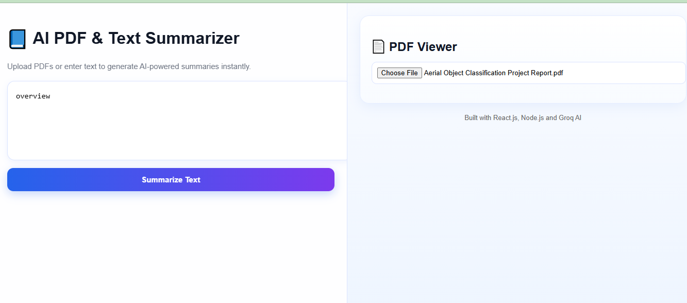
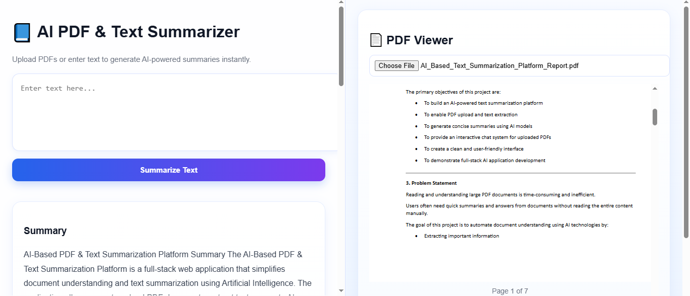
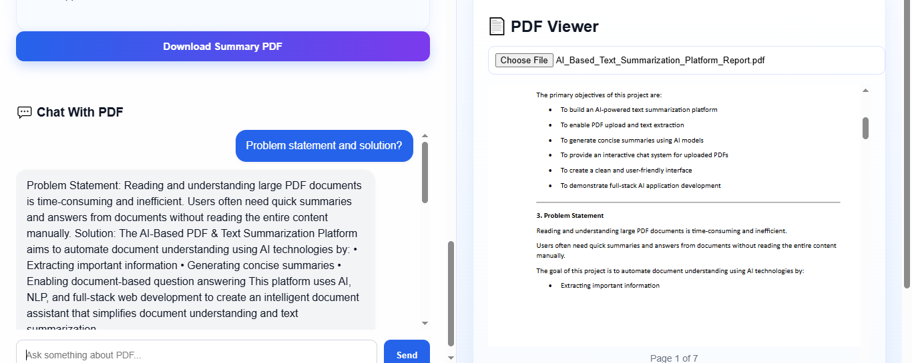

# AI-Based PDF & Text Summarization Platform

An AI-powered full-stack web application that allows users to upload PDF documents, generate AI-powered summaries, summarize custom text input, download summaries as PDF reports, and interact with uploaded PDFs using an intelligent chat system.

Built using React.js, Node.js, Express.js, Groq AI, and Natural Language Processing (NLP).

---

# Features

## PDF Upload & Parsing
- Upload PDF documents directly from the browser
- Extract text automatically from uploaded PDFs
- Support for multi-page PDF viewing

## AI PDF Summarization
- Generate concise AI-powered summaries from uploaded PDFs
- Uses Groq LLM API for intelligent summarization

## AI Text Summarization
- Paste custom text into the application
- Generate instant AI summaries

## Chat With PDF
- Ask questions related to uploaded PDF documents
- AI responds using extracted PDF content

## Download Summary as PDF
- Export AI-generated summaries as professional PDF reports
- Dynamic report title generation
- Clean formatted PDF layout

## Modern UI
- Clean and responsive dashboard-style interface
- Multi-panel PDF viewer and AI chat layout
- Professional and user-friendly design

---

# Tech Stack

## Frontend
- React.js
- React Hooks
- react-pdf

## Backend
- Node.js
- Express.js

## AI / NLP
- Groq API
- Llama 3.1 Model

## PDF Processing
- pdf-parse
- multer

## Development Tools
- Visual Studio Code
- Git & GitHub
- Postman

---

# Project Structure

```bash
AI-Based-Text-Summarization-Platform/
│
├── frontend/
│
├── backend/
│   ├── routes/
│   ├── services/
│   ├── uploads/
│   ├── texts/
│   └── server.js
│
├── Screenshots/
│
└── README.md
```

---

# Installation & Setup

## 1. Clone Repository

```bash
git clone https://github.com/VinayPandey185/AI-Based-Text-Summarization-Platform.git
```

---

# Backend Setup

```bash
cd backend
npm install
```

## Create `.env` File

```env
GROQ_API_KEY=your_api_key_here
```

## Run Backend Server

```bash
node server.js
```

Backend runs on:

```bash
http://localhost:5000
```

---

# Frontend Setup

```bash
cd frontend
npm install
npm start
```

Frontend runs on:

```bash
http://localhost:3000
```

---

# Application Screenshots

## Main Dashboard UI



---

## PDF Upload & AI Summary



---

## Chat With PDF



---

# Example Use Cases

- Research paper summarization
- Academic PDF analysis
- AI-powered document assistant
- Notes summarization
- PDF-based question answering
- Business report summarization

---

# Future Improvements

- Real page citation support
- Semantic vector search
- User authentication
- Multiple document support
- Cloud deployment
- Dark mode support
- Database integration

---

# Author

**Vinay Pandey**

GitHub:  
https://github.com/VinayPandey185

---

# Project Highlights

This project demonstrates:

- AI integration with Groq LLM
- PDF text extraction & processing
- NLP-based summarization
- Document-based question answering
- Full-stack application development
- Interactive PDF viewing
- REST API integration
- Professional UI/UX implementation
- AI summary PDF export feature

---

# Note

This project was developed as part of an AI/NLP-based assignment project and demonstrates practical implementation of:

- Artificial Intelligence integration
- NLP summarization
- PDF document processing
- AI-powered document chat
- Full-stack web application development
- Modern React frontend architecture
- REST API backend integration